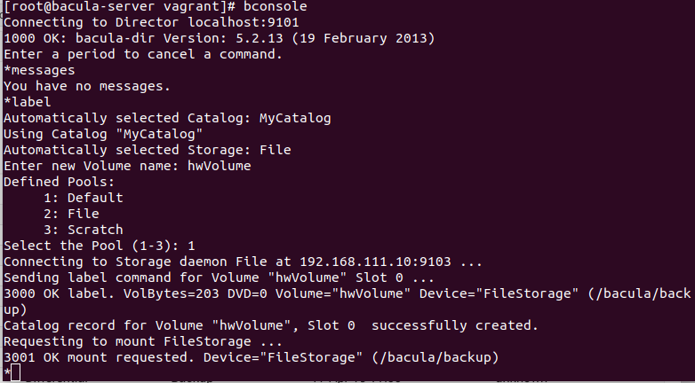
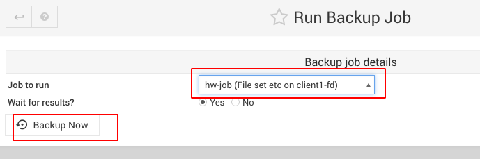

### Резервное копирование с Backup ###

Настроить стенд Vagrant с двумя виртуальными машинами server и client.

Настроить политику бэкапа директории /etc с клиента:

1) Полный бэкап - раз в день
2) Инкрементальный - каждые 10 минут
3) Дифференциальный - каждые 30 минут

Запустить систему на два часа. Для сдачи ДЗ приложить list jobs, list files jobid=<id>
и сами конфиги bacula-*

 нужен, чтобы работал коннектор вебмина к постгресу

(не выполнено) задание со звездой: Настроить доп. Опции - сжатие (настраивается в FileSet гуя бакулы), шифрование, дедупликация

очень помогло в настройку [видео по bacula+webmin](https://www.youtube.com/watch?v=xbWB-bmT53Q&t=345s)

перед запуском стенда надо перезагрузить виртуалки - _vagrant reload_. Это делается для отключения selinux.

на стенде поднят вебмин, доступ через браузер 192.168.111.10:10000. Пароль для доступа к директору генерится в вагрантфайле переменной PG_BACULA_PASSWORD, сгенеренный посмотреть можно в /etc/bacula/bacula-dir.conf виртуалки server.

bconsole - утилита, запускаемая из баш от рута. Позволяет управлять бакулой из консоли, но гуй удобнее, в моем случае это вебмин.

для запуска бэкапа надо:

1. в консоли сервера:

    bconsole

    label

    <дать имя>
    

2. нажать Run Backup Job в разделе Backup and Restore Actions

Результаты:

list jobs

list files jobid=<id>

