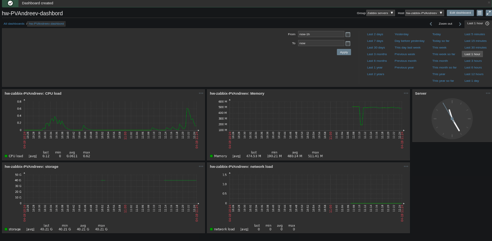

### Настройка мониторинга ###

Настроить дашборд с 4-мя графиками

1) память
2) процессор
3) диск
4) сеть

настроить на одной из систем

- zabbix (использовать screen (комплексный экран))
- prometheus - grafana

задача* использование систем примеры которых не рассматривались на занятии (Nagios/icinga; graphite, cacti/ganglia/collectd, mrtg, munin с rrdtool; netdata; prometheus; influxdata; statsd+graphana)

в качестве результата прислать скриншот экрана - дашборд должен содержать в названии имя приславшего

Критерии оценки: 5 - основное задание, 6 - задание со зведочкой

перед запуском стенда надо перезагрузить виртуалку - _vagrant reload_. Это делается для отключения selinux.

делалось по [этому мануалу](https://serveradmin.ru/ustanovka-i-nastroyka-zabbix-4-0/) 

TODO (done) настроить фронт заббикса

TODO установить и настроить statsd+graphana

важно, надо ставить заббикс-агент, настроить его по вышеуказанному мануалуВо фронте при настройке хоста его доступность будет серой до тех пор, пока не настроено ЧТО мониторить.

порядок настройки: Configuration - Hosts - Create Host. Потом заводятся Items и Graphs. При настройке дашборда графы подсовываются через пункт Graph (classic)
