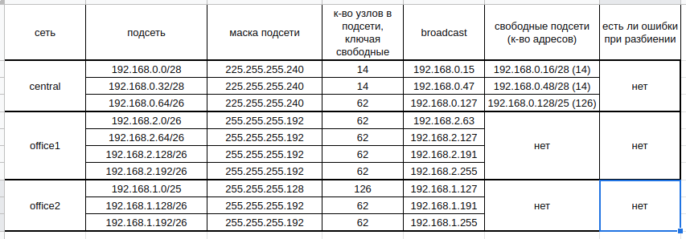
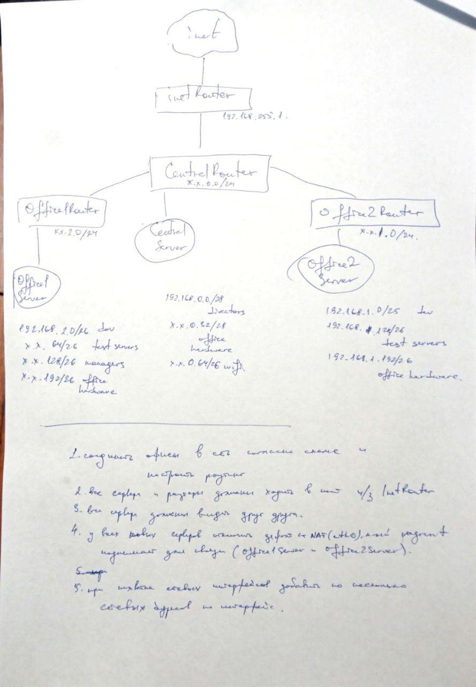
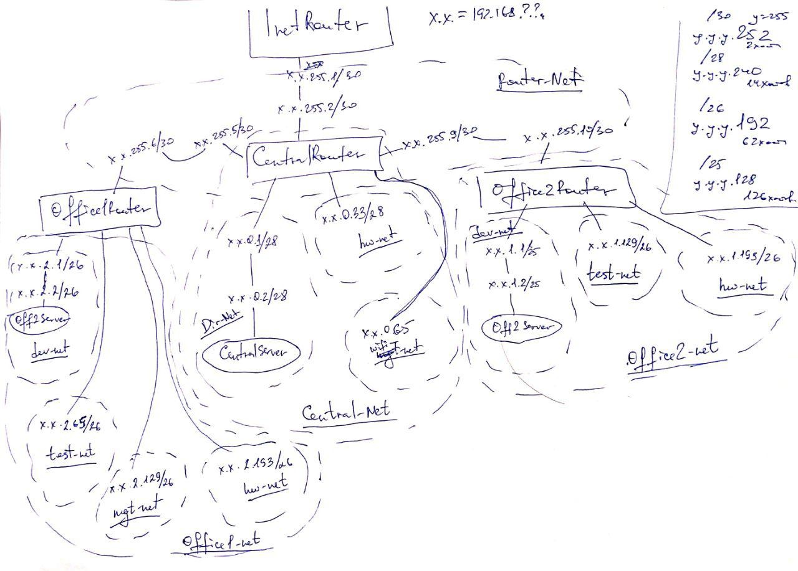

## Network Basics

### homework

разворачиваем сетевую лабораторию

    # otus-linux

Vagrantfile - для стенда урока 9 - Network

Дано https://github.com/erlong15/otus-linux/tree/network (ветка network)

Vagrantfile с начальным построением сети
- inetRouter
- centralRouter
- centralServer

тестировалось на virtualbox

#### Планируемая архитектура

построить следующую архитектуру

Сеть office1
- 192.168.2.0/26 - dev
- 192.168.2.64/26 - test servers
- 192.168.2.128/26 - managers
- 192.168.2.192/26 - office hardware

Сеть office2
- 192.168.1.0/25 - dev
- 192.168.1.128/26 - test servers
- 192.168.1.192/26 - office hardware


Сеть central
- 192.168.0.0/28 - directors
- 192.168.0.32/28 - office hardware
- 192.168.0.64/26 - wifi

```
Office1 ---\
            -----> Central --IRouter --> internet
Office2----/
```
Итого должны получится следующие сервера
- inetRouter
- centralRouter
- office1Router
- office2Router
- centralServer
- office1Server
- office2Server

# Теоретическая часть
- Найти свободные подсети
- Посчитать сколько узлов в каждой подсети, включая свободные
- Указать broadcast адрес для каждой подсети
- проверить нет ли ошибок при разбиении



# Практическая часть
- Соединить офисы в сеть согласно схеме и настроить роутинг
- Все сервера и роутеры должны ходить в инет черз inetRouter
- Все сервера должны видеть друг друга
- у всех новых серверов отключить дефолт на нат (eth0), который вагрант поднимает для связи
- при нехватке сетевых интерфейсов добавить по несколько адресов на интерфейс

Критерии оценки: 4 - сделана хотя бы часть
5 - все сделано

## history

схема по заданию



схема, разрисованная по логике задания



выполнено на centos/6 1905.01 и centos/7 1905.1

## memo

_протокол - набор правил и требований (регламент), по которым участники сетевого общения общаются между собой, позволяющий отличать корректные/некорректные, свои/чужие, дружественные/вражеские пакеты_

для подсчета в битовом виде существует утилита _ipcalc_

## трудности

1. ВСЕГДА рисовать схему сети с интерфейсами
2. проверять настройки на каждом хосте
3. быть внимательнее

### вопросы

1. как почистить arp-кэш на всех устройствах в сети
2. как убрать вот такую ошибку

    64 bytes from 192.168.1.2: icmp_seq=1 ttl=62 time=4.29 ms
    From 192.168.255.5 icmp_seq=2 Redirect Host(New nexthop: 192.168.255.10)