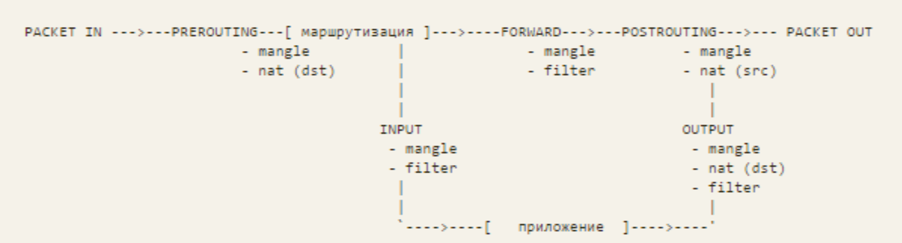

# Фильтрация трафика
## iptables/firewalld

###hw

Сценарии iptables

1. реализовать knocking port. centralRouter может попасть на ssh inetrRouter через knock скрипт. Пример в материалах
2. добавить inetRouter2, который виден(маршрутизируется (host-only тип сети для виртуалки)) с хоста или форвардится порт через локалхост
3. запустить nginx на centralServer
4. пробросить 80й порт на inetRouter2 8080
5. дефолт в инет оставить через inetRouter

* реализовать проход на 80й порт без маскарадинга

Критерии оценки: 5 - все сделано

### теория

port knocking ("простукивание порта")- технология, позволяющая получить доступ снаружи к закрытому порту(ам). Для этого используется предопределённое "простукивание" заданных закрытых портов. После получения правильной последовательности файрвол открывает нужный порт (порты). Может выполняться с помощью:

1. демона knockd
2. iptables
3. и то, и другое с помощью скрипта

### выполнение

перед тем, как сделать vagrant up, надо сделать

        ssh-keygen -y -f ~/.vagrant.d/insecure_private_key > ~/.vagrant.d/insecure_key.pub

сделать knoking port можно так: [быстро](https://otus.ru/nest/post/267/) и [подробно](https://wiki.archlinux.org/index.php/Port_knocking)

        # ./knock.sh 192.168.255.1 8881 7777 9991 && ssh 192.168.255.1 -vvv

### литература

1. [Port knocking](https://wiki.archlinux.org/index.php/Port_knocking)
2. [Port knocking по-русски](https://otus.ru/nest/post/267/)