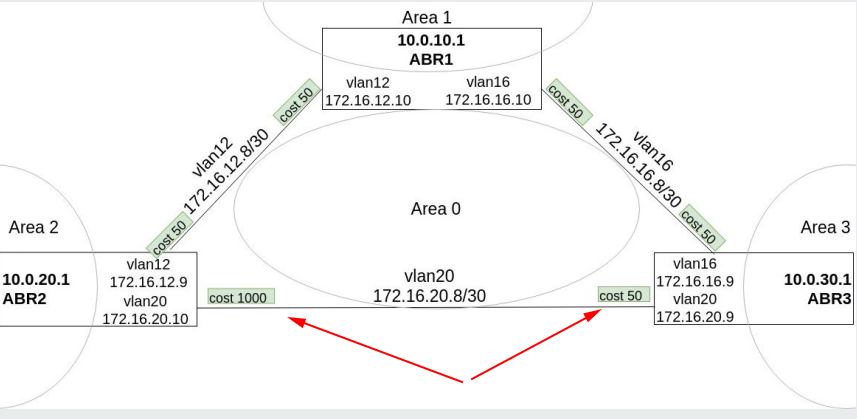
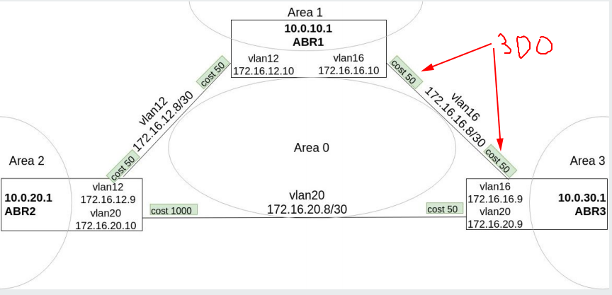

## OSPF

#### hw

- Поднять три виртуалки
- Объединить их разными vlan

1. Поднять OSPF между машинами на базе Quagga
2. Изобразить ассиметричный роутинг
3. Сделать один из линков "дорогим", но что бы при этом роутинг был симметричным

В примере из методички уже сделан ассиметричный роутинг (цены указаны стрелками)

Потом изменил по стрелкам стоимость на 300

Просношавшись надцать часов, понял, что эта фигня в одном файле не взлетает, надо что-то одно делать. Поэтому так:

1. [нормальный]('1. normal'/) вариант с _cost 50_
2. [ассиметричный]('2. asymmetric'/) вариант, сделано как в примере, на 172.16.20.10 повешен _cost 1000_
3. [дорогой vlan12]('3. symmetric'/). На vlan12 повешен _cost 300_ с обоих сторон

### memo

лучше делать настройки изнутри квагги, которая в настройке очень похожа на циску и умеет понимать короткие команды. По нажатию ? на клаве показывает справку

Проверить соседей

    show ip ospf neighbors

посмотреть что запущено сейчас

    show run

